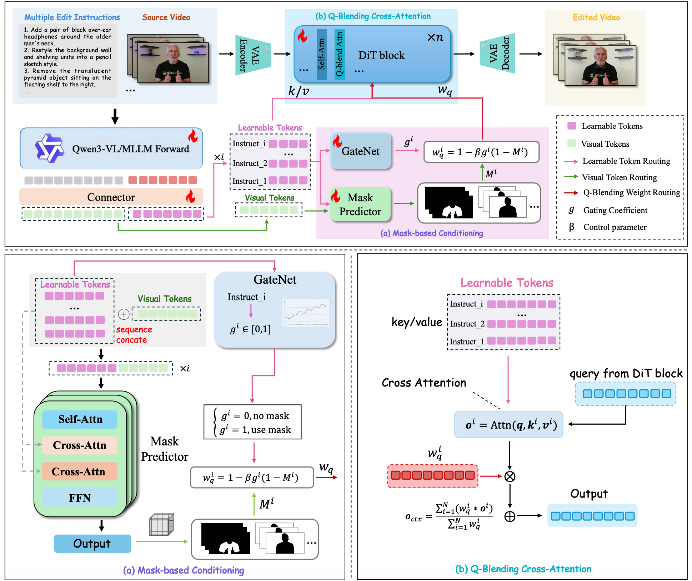

# CoinVE-Edit: Compositional Instruction-Guided Video Editing Model

<div align="center">

  <a href="https://huggingface.co/FireCRT/CoinVE-Edit"></a> &ensp;

</div>

<div align="center">
  
</div>

---

## ✨ Highlights

- **Compositional Multi-Instruction Editing**: CoinVE-Edit processes 2–5 editing instructions in a single forward pass, applying each edit to its designated region simultaneously.
- **Region-Aware Mask Guidance**: Per-instruction mask injection via a lightweight mask head ensures each edit is confined to the correct spatial region, enabling precise compositional editing.
- **Built on Wan2.1-T2V-14B and Qwen3-VL-8B**: Leveraging a powerful video DiT and MLLM encoder for high-quality region-aware compositional instruction video editing.


## 🌍 Introduction

**CoinVE-Edit** is a video editing model trained on the [CoinVE-200K](https://huggingface.co/datasets/FireCRT/CoinVE-200K) dataset, designed to support **compositional instruction-guided video editing**. Unlike prior models that process a single instruction at a time, CoinVE-Edit can handle **multiple editing instructions simultaneously**, applying each edit to its designated region while maintaining overall video coherence.

**Key capabilities:**
- **Multi-Instruction Editing**: Process 2–5 editing instructions in a single forward pass.
- **Region-Aware Editing**: Per-instruction mask guidance ensures each edit is confined to the correct spatial region.
- **Compositional Operations**: Supports Replace, Add, Remove, and Background Change operations in any combination.
- **High-Quality Output**: Trained on 211K+ high-quality video-edit pairs with rigorous data filtering.

CoinVE-Edit is built on a video DiT architecture (Wan2.1-T2V-14B) with a Qwen3-VL-8B MLLM encoder, leveraging a residual-attention module and a lightweight mask head to inject region-aware guidance for compositional editing.


## 🏗️ Architecture

CoinVE-Edit extends the Wan2.1-T2V-14B video DiT with the following components:

| Component | Description |
|-----------|-------------|
| **Video DiT** | Wan2.1-T2V-14B as the backbone diffusion transformer (LoRA-tuned, rank 128). |
| **MLLM Encoder** | Qwen3-VL-8B-Instruct provides multimodal understanding of instructions and visual context (LoRA-tuned, rank 256). |
| **Mask Head** | A lightweight transformer head that predicts per-instruction spatial masks from MLLM visual tokens. |
| **Residual Attention** | A residual-attention module that injects per-instruction mask guidance into the DiT's attention layers. |

During inference, the MLLM encodes each instruction together with the source video, the mask head predicts a region mask per instruction, and the residual-attention module steers the DiT to apply each edit only within its masked region.


## 📥 Model Weights

CoinVE-Edit is trained on top of two base models that must be downloaded before inference:

| Base Model | HuggingFace | Description |
|------------|-------------|-------------|
| Wan2.1-T2V-14B | [Wan-AI/Wan2.1-T2V-14B](https://huggingface.co/Wan-AI/Wan2.1-T2V-14B/tree/main) | Video diffusion transformer (DiT) + VAE |
| Qwen3-VL-8B-Instruct | [Qwen/Qwen3-VL-8B-Instruct](https://huggingface.co/Qwen/Qwen3-VL-8B-Instruct) | Multimodal LLM encoder |

The CoinVE-Edit checkpoint (`.safetensors`) is available below:

| Model | HuggingFace | Description |
|-------|-------------|-------------|
| `CoinVE-Edit` | [FireCRT/CoinVE-Edit](https://huggingface.co/FireCRT/CoinVE-Edit) | Full checkpoint trained on CoinVE-200K |

The checkpoint contains the DiT LoRA weights, MLLM LoRA weights, learned image/video query embeddings, connector, VAE condition encoder, and the mask head weights.


## 🔧 Installation

### Environment Requirements

- Python 3.10+
- CUDA 12.8
- PyTorch 2.8+
- FlashAttention-3 (`flash_attn_interface`, v3.0.0b1) for the video DiT
- For training: DeepSpeed

### Full Environment Setup

```bash
# Create conda environment
conda create -n coinve python=3.10 -y
conda activate coinve

# Install PyTorch 2.8.0 with CUDA 12.8
pip install torch==2.8.0 torchvision==0.23.0 torchaudio==2.8.0 --index-url https://download.pytorch.org/whl/cu128

# Install dependencies
pip install -e .
pip install transformers accelerate wandb

# Install FlashAttention-3 (used by the Wan2.1 video DiT)
# Prebuilt wheel for CUDA 12.9 + PyTorch 2.8.0 (aarch64):
pip install https://github.com/windreamer/flash-attention3-wheels/releases/download/2026.01.26-f6c4937/flash_attn_3-3.0.0b1+20260126.cu129torch280cxx11abitrue.438325-cp39-abi3-linux_aarch64.whl
```


## 🚀 Inference

### Single-Video Editing

Edit one video with one or more instructions on a single GPU.

**Step 1.** Open `infer_coinve_single.sh` and set the base model paths at the top of the script:

```bash
LOCAL_MODEL_PATH="/path/to/base_models"                                              # root dir containing Wan-AI/Wan2.1-T2V-14B/
MLLM_MODEL="/path/to/Qwen3-VL-8B-Instruct"                                           # Qwen3-VL-8B-Instruct checkpoint dir
COMPOSITE_CKPT="/path/to/FireCRT/CoinVE-Edit/coinve_edit_composite_vllm256_dit128.safetensors"  # CoinVE-Edit checkpoint
```

`LOCAL_MODEL_PATH` is the root directory under which the Wan2.1-T2V-14B checkpoint lives as `<LOCAL_MODEL_PATH>/Wan-AI/Wan2.1-T2V-14B/` (download from [Wan-AI/Wan2.1-T2V-14B](https://huggingface.co/Wan-AI/Wan2.1-T2V-14B)). `MLLM_MODEL` points directly at the Qwen3-VL-8B-Instruct checkpoint directory (download from [Qwen/Qwen3-VL-8B-Instruct](https://huggingface.co/Qwen/Qwen3-VL-8B-Instruct)). `COMPOSITE_CKPT` points to the CoinVE-Edit checkpoint (download from [FireCRT/CoinVE-Edit](https://huggingface.co/FireCRT/CoinVE-Edit)).

**Step 2.** Run:

```bash
bash infer_coinve_single.sh
```

Or call the Python script directly:

```bash
python infer_coinve_single.py \
  --src_video ./demo_data/source_video.mp4 \
  --prompts "Replace the car with a red truck." "Add a dog on the sidewalk." \
  --composite_checkpoint /path/to/FireCRT/CoinVE-Edit/coinve_edit_composite_vllm256_dit128.safetensors \
  --local_model_path /path/to/base_models \
  --mllm_model /path/to/Qwen3-VL-8B-Instruct \
  --output_dir ./output/single/ \
  --eval_max_pixels 921600 \
  --eval_max_frame 49 \
  --num_inference_steps 50 \
  --seed 0 \
  --show_progress \
  --save_instruction_masks
```

The script saves a side-by-side video `[source | edited]` by default. Pass `--no_side_by_side` to save only the edited video. Use `--save_instruction_masks` to additionally save per-instruction mask overlay videos.

#### Performance

Single-GPU inference cost on **NVIDIA H200** (720p, 49 frames, 50 diffusion steps):

| Metric | Value |
|--------|-------|
| GPU memory | 53.7 GB |
| Wall time | 279 s |

#### Key Arguments (`infer_coinve_single.py`)

| Argument | Default | Description |
|----------|---------|-------------|
| `--src_video` | required | Path to source video. |
| `--prompts` | required | One or more editing instructions. |
| `--composite_checkpoint` | required | Path to CoinVE-Edit checkpoint. |
| `--local_model_path` | required | Root dir containing `Wan-AI/Wan2.1-T2V-14B/`. |
| `--mllm_model` | required | Path to Qwen3-VL-8B-Instruct checkpoint directory. |
| `--output_dir` | required | Output directory. |
| `--eval_max_pixels` | 921600 | Max pixels per frame for source resize. |
| `--eval_max_frame` | 49 | Max frames to read from the source. |
| `--num_inference_steps` | 50 | Diffusion sampling steps. |
| `--seed` | 0 | Random seed. |

### Batch Inference on CoinVE-Bench

Run multi-GPU inference over the CoinVE-Bench checklist JSON (361 cases).

**Step 1.** Open `infer_coinve_bench.sh` and set these paths at the top of the script:

```bash
EVAL_PATH="/path/to/coinve-bench-361-checklist.json"
DATA_ROOT="/path/to/CoinVE-Bench"               # root dir for resolving src_videos/xxx.mp4
COMPOSITE_CKPT="/path/to/step-XXXX.safetensors"
LOCAL_MODEL_PATH="/path/to/base_models"          # root dir containing Wan-AI/Wan2.1-T2V-14B/
MLLM_MODEL="/path/to/Qwen3-VL-8B-Instruct"       # Qwen3-VL-8B-Instruct checkpoint dir
```

`EVAL_PATH` points to the CoinVE-Bench checklist JSON (download from [FireCRT/CoinVE-Bench](https://huggingface.co/datasets/FireCRT/CoinVE-Bench)). Only `src_video` and `instruction` fields are required. `DATA_ROOT` is the CoinVE-Bench dataset directory used to resolve relative paths like `src_videos/xxx.mp4`. `LOCAL_MODEL_PATH` and `MLLM_MODEL` follow the same convention as single-video inference above.

**Step 2.** Run:

```bash
bash infer_coinve_bench.sh
```

This launches an `accelerate` DDP job across 4 GPUs (configurable via `CUDA_VISIBLE_DEVICES` and `NUM_GPUS` in the script). Key parameters inside `infer_coinve_bench.sh`:

| Variable | Description |
|----------|-------------|
| `EVAL_PATH` | Evaluation metadata file (`.json`). Only `src_video` and `instruction` fields are required. |
| `DATA_ROOT` | Root directory for resolving relative video paths in the metadata. |
| `COMPOSITE_CKPT` | Path to the CoinVE-Edit `.safetensors` checkpoint. |
| `LOCAL_MODEL_PATH` | Root dir containing `Wan-AI/Wan2.1-T2V-14B/`. |
| `MLLM_MODEL` | Path to Qwen3-VL-8B-Instruct checkpoint directory. |
| `NUM_GPUS` | Number of GPUs for DDP inference. |

Outputs are written to `${OUTPUT_BASE_DIR}/videos/`:

- Triptych mp4 per sample (`<idx:04d>_K<n>_<prompt>_<src_stem>.mp4`)
- Standalone edited videos at `tgt_videos/<case_id>.mp4` — already in the `{id}.mp4` naming convention expected by the CoinVE-Bench evaluator (see [CoinVE-Bench/README.md](../CoinVE-Bench/README.md))

#### Key Arguments (`infer_coinve_bench.py`)

| Argument | Default | Description |
|----------|---------|-------------|
| `--eval_json_path` | required | Evaluation metadata file (`.json`). Only `src_video` and `instruction` fields are required. |
| `--data_root` | `""` | Root directory for resolving relative video paths in the metadata. |
| `--composite_checkpoint` | required | Path to CoinVE-Edit checkpoint. |
| `--local_model_path` | required | Root dir containing `Wan-AI/Wan2.1-T2V-14B/`. |
| `--mllm_model` | required | Path to Qwen3-VL-8B-Instruct checkpoint directory. |
| `--output_dir` | required | Output directory (side-by-side video + optional mask videos). |
| `--eval_max_frame` | 49 | Max frames to read from the source. |
| `--eval_max_pixels` | 921600 | Max pixels per frame for source resize. |
| `--num_inference_steps` | 50 | Diffusion sampling steps. |

| `--seed` | 0 | Random seed. |
| `--skip_existing` | true | Skip samples whose output video already exists. |


## 📊 Results

### CoinVE-Bench

| Model | Overall | Instruction | Temporal | Regional | Visual |
|-------|---------|-------------|----------|----------|--------|
| **CoinVE-Edit** | TBD | TBD | TBD | TBD | TBD |
| Baseline (single-instr) | TBD | TBD | TBD | TBD | TBD |


## 📜 Citation

If you find CoinVE-Edit useful for your research, please cite our work:

```bibtex
@article{coinve200k,
  title={CoinVE-200K: A Large-Scale High-Quality Dataset for Compositional Instruction-Guided Video Editing},
  author={Long, Fuchen and Wang, Cong and Gao, Zitao and Zhong, Wenhao and Cheng, Yu and Hou, Xiaolu and Li, Yan and Cao, Xiao and Sun, Xinlong and Chen, Xi and Liu, Yu},
  journal={arXiv preprint arXiv:xxxx.xxxxx},
  year={2026}
}
```


## ✉️ Contact

For any questions, issues, or collaborations, please feel free to contact longfc.ustc@gmail.com.


## 💖 Acknowledgement

Our model is built upon [DiffSynth-Studio](https://github.com/modelscope/DiffSynth-Studio), [Wan2.1](https://github.com/Wan-Video/Wan2.1), and inspired by [Kiwi-Edit](https://github.com/showlab/Kiwi-Edit). Thanks to the contributors of all these great projects!
