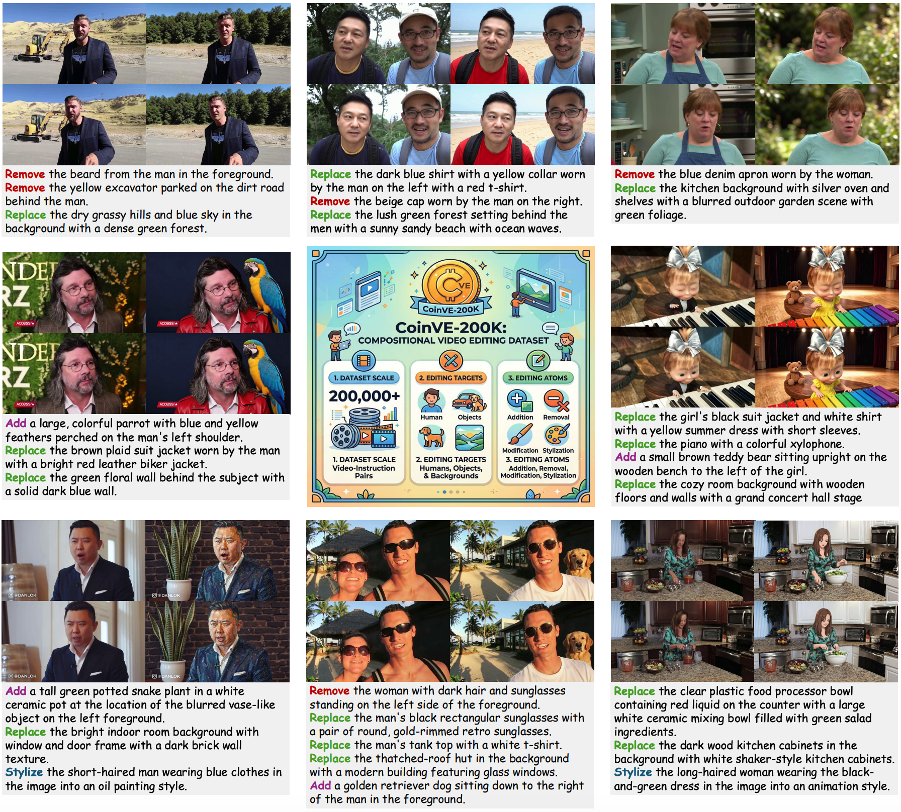

<div align="center">
  
</div>
<h1 align="center" style="line-height: 50px;">
  CoinVE-200K: A Large-Scale High-Quality Dataset for Compositional Instruction-Guided Video Editing
</h1>

<div align="center">

Fuchen Long, Cong Wang, Zitao Gao, Wenhao Zhong, Yu Cheng, Xiaolu Hou<br>
Yan Li, Xiao Cao, Xinlong Sun<sup>†</sup>, Xi Chen<sup>✉</sup>, Yu Liu

<sup>†</sup> Project Leader &ensp; <sup>✉</sup> Corresponding Author

<b>Smart Creation Platform Department, Online Video BU, Tencent</b>


</div>

<div align="center">
  <a href="https://coinve.github.io/"></a> &ensp;
  <a href="https://arxiv.org/abs/xxxx.xxxxx"></a>
  <br>
  <a href="https://huggingface.co/datasets/FireCRT/CoinVE-200K"></a> &ensp;
  <a href="https://huggingface.co/FireCRT/CoinVE-Edit"></a> &ensp;
  <a href="https://huggingface.co/datasets/FireCRT/CoinVE-Bench"></a>
</div>

---

## 🚀 News

- **[2026.08.18]** Release CoinVE-200K dataset and CoinVE-Bench benchmark on HuggingFace.
- **[2026.08.18]** Release CoinVE-Edit model weights on HuggingFace.
- **[2026.08.18]** Project page is available.


## ✨ Highlights

- **[CoinVE-200K](https://huggingface.co/datasets/FireCRT/CoinVE-200K)**: Large-scale compositional instruction-guided video editing dataset with 200K+ samples, ~2.6 TB, featuring per-instruction and combined region masks.
- **[CoinVE-Edit](CoinVE-Edit/)**: Built on Wan2.1-T2V-14B and Qwen3-VL-8B, performs region-aware compositional instruction video editing.
- **[CoinVE-Bench](CoinVE-Bench/)**: Provides 361 multi-instruction test cases with 4-dimensional evaluation metrics.


## 🌍 Introduction

Instruction-guided video editing has witnessed rapid progress recently, driven by large-scale datasets and diffusion-based video generation models. However, existing open-source datasets (e.g., ReCo-Data, OpenVE-3M) primarily focus on **single-instruction editing** — applying one editing operation (e.g., replace, add, remove, or stylize) to a source video at a time. This limits the practical capability of trained models in real-world scenarios where users often issue **multiple editing instructions simultaneously** for a single video. To bridge this gap, we introduce **CoinVE-200K**, a large-scale, high-quality dataset for **compositional instruction-guided video editing**. Each sample in CoinVE-200K contains **multiple instructions** applied to the same source video, along with **per-instruction region masks** and a **combined mask** indicating all edited regions. The dataset is constructed through a meticulously designed data pipeline with rigorous quality filtering, ensuring diversity in instruction combinations, editing types, and video content.

**Key features of CoinVE-200K:**
- **Compositional Instructions**: Each sample contains 2–5 instructions covering different editing operations (Replace, Add, Remove, Background Change, etc.) on different regions (subject, object, background).
- **Region-Aware Masks**: Per-instruction masks indicate the spatial region of each edit, and a combined mask aggregates all edited regions for holistic supervision.
- **Large Scale & High Quality**: 200K+ video-edit pairs with ~1.18M video files, totaling ~2.6 TB, sourced from diverse open-source video collections.
- **Rich Annotations**: Each sample includes structured fields — instruction text, operation type, object type, and corresponding mask video paths.

<div align="center">

<p><b>Demonstration of compositional instruction-guided video editing cases from CoinVE-200K.</b></p>
</div>


## 📊 Dataset Statistics

### Overview

| Metric | Value |
|--------|-------|
| Video source | Subset of [OpenVid-1M](https://github.com/NJU-PCALAB/OpenVid-1M) (i.e., [OpenVidHD](https://huggingface.co/datasets/nkp37/OpenVid-1M/tree/main/OpenVidHD)) |
| Total editing samples | 200,916 |
| Video resolution | 1080P |
| Max edited frames | 201 |
| Total size | ~2.6 TB |
| Instructions per sample | 2~5 (avg. 2.55) |


### File Distribution

| Type | Directory | Shards | Files | Size |
|------|-----------|--------|-------|------|
| Source video | `src_videos/` | 74 | 194,450 | ~1.5 TB |
| Edited video | `tgt_videos/` | 41 | 200,916 | ~813 GB |
| Combined mask | `combined_masks/` | 8 | 223,773 | ~147 GB |
| Instruction mask | `instruction_masks/` | 10 | 558,717 | ~176 GB |


## 📁 Dataset Structure

### Directory Layout

```text
CoinVE-200K/
├── src_videos/
│   ├── src_video_000.tar
│   ├── src_video_001.tar
│   └── ...
├── tgt_videos/
│   ├── tgt_video_000.tar
│   └── ...
├── combined_masks/
│   ├── combined_masks_000.tar
│   └── ...
├── instruction_masks/
│   ├── instruction_masks_000.tar
│   └── ...
└── metadata_coinve200k.jsonl
```

### Tar Archive Structure

Each tar archive contains video files with relative paths:

```text
src_video_000.tar
├── src_video_000/
│   ├── UWPBxW-hVEY_3_28to136.mp4
│   ├── VRWPztEQZwQ_67_0to117.mp4
│   └── ...

instruction_masks_003.tar
├── instruction_masks_003/
│   ├── UWPBxW-hVEY_3_28to136_86c7745f/
│   │   ├── instr_mask_01.mp4
│   │   ├── instr_mask_02.mp4
│   │   └── instr_mask_03.mp4
│   └── ...
```

### metadata_coinve200k.jsonl Format

Each line is a JSON object representing one editing sample:

```json
{
  "source_video_path": "src_videos/src_video_067/UWPBxW-hVEY_3_28to136.mp4",
  "edited_video_path": "tgt_videos/tgt_video_039/UWPBxW-hVEY_3_28to136_86c7745f.mp4",
  "instruction": [
    "Replace the white styrofoam takeout container with a brown cardboard clamshell burger box.",
    "Add a large silver metal fork resting on top of the french fries in the right side of the container.",
    "Replace the outdoor concrete sidewalk background with a dark wooden table surface."
  ],
  "instruction_operation": ["Replace", "Add", "Replace"],
  "instruction_object": ["subject", "object", "background"],
  "instruction_mask_video_paths": [
    "instruction_masks/instruction_masks_003/UWPBxW-hVEY_3_28to136_86c7745f/instr_mask_01.mp4",
    "instruction_masks/instruction_masks_003/UWPBxW-hVEY_3_28to136_86c7745f/instr_mask_02.mp4",
    "instruction_masks/instruction_masks_003/UWPBxW-hVEY_3_28to136_86c7745f/instr_mask_03.mp4"
  ],
  "combined_mask_video_path": "combined_masks/combined_masks_004/UWPBxW-hVEY_3_28to136_86c7745f_combined_mask.mp4"
}
```


## 📥 Download

### Full Dataset

```bash
# Download all files from HuggingFace
hf download FireCRT/CoinVE-200K --repo-type dataset --local-dir ./CoinVE-200K
```

### Partial Download

You can download specific file types to save bandwidth:

```bash
# Download metadata only
hf download FireCRT/CoinVE-200K metadata_coinve200k.jsonl --repo-type dataset --local-dir ./CoinVE-200K

# Download specific src_videos shards
hf download FireCRT/CoinVE-200K \
  src_videos/src_video_000.tar src_videos/src_video_001.tar \
  --repo-type dataset --local-dir ./CoinVE-200K
```


## 🔧 Usage

### Load Metadata

```python
import json

with open("CoinVE-200K/metadata_coinve200k.jsonl", "r") as f:
    samples = [json.loads(line) for line in f]

print(f"Total samples: {len(samples)}")
print(f"First sample instructions: {samples[0]['instruction']}")
```

### Extract Tar Archives

The dataset is distributed as `.tar` shards. Extract them before loading:

```bash
# Extract all source video shards
for tar in src_videos/*.tar; do tar -xf "$tar" -C src_videos/; done

# Extract all other types similarly
for tar in tgt_videos/*.tar; do tar -xf "$tar" -C tgt_videos/; done
for tar in combined_masks/*.tar; do tar -xf "$tar" -C combined_masks/; done
for tar in instruction_masks/*.tar; do tar -xf "$tar" -C instruction_masks/; done
```

After extraction the directory layout matches the relative paths in `metadata_coinve200k.jsonl`:

```text
CoinVE-200K/
├── src_videos/src_video_067/UWPBxW-hVEY_3_28to136.mp4
├── tgt_videos/tgt_video_039/UWPBxW-hVEY_3_28to136_86c7745f.mp4
├── instruction_masks/instruction_masks_003/UWPBxW-hVEY_3_28to136_86c7745f/instr_mask_01.mp4
├── combined_masks/combined_masks_004/UWPBxW-hVEY_3_28to136_86c7745f_combined_mask.mp4
└── metadata_coinve200k.jsonl
```

### Data Loading with `coinve_dataset.py`

We provide a ready-to-use PyTorch dataset loader at [`coinve_dataset.py`](coinve_dataset.py).
It reads `metadata_coinve200k.jsonl`, resolves the relative paths against the extracted
dataset root, and loads synchronised frames for the source video, edited video,
per-instruction masks, and combined mask. Frame-count sampling, spatial resizing,
and src/tgt/mask alignment are handled by the same primitives used in training
(`LoadVideo` / `LoadMaskVideo` / `ImageCropAndResize` from `CoinVE-Edit/`).

```python
from coinve_dataset import CoinVEDataset

dataset = CoinVEDataset(
    base_path="./CoinVE-200K",          # extracted dataset root
    metadata_path="./CoinVE-200K/metadata_coinve200k.jsonl",
    num_frames=81,
    max_pixels=1920 * 1080,
    height_division_factor=16,
    width_division_factor=16,
)

sample = dataset[0]
print(sample["instruction"])                  # list[str], e.g. 3 instructions
print(len(sample["src_video"]))               # 81 (or fewer for short clips)
print(len(sample["tgt_video"]))               # 81, synced with src_video
print(len(sample["instruction_masks"]))       # equals len(instruction)
print([len(m) for m in sample["instruction_masks"]])  # per-instruction frame counts
print(sample["combined_mask"] is not None)    # True when a combined mask exists
print(len(sample["combined_mask"]))           # 81, synced with src/tgt
```

Use it with a `torch.utils.data.DataLoader` for batched training or evaluation:

```python
from torch.utils.data import DataLoader

loader = DataLoader(dataset, batch_size=4, shuffle=True, num_workers=4)
for batch in loader:
    ...
```


## 📜 Citation

If you find CoinVE-200K useful for your research, please cite our work:

```bibtex
@article{coinve200k,
  title={CoinVE-200K: A Large-Scale High-Quality Dataset for Compositional Instruction-Guided Video Editing},
  author={Long, Fuchen and Wang, Cong and Gao, Zitao and Zhong, Wenhao and Cheng, Yu and Hou, Xiaolu and Li, Yan and Cao, Xiao and Sun, Xinlong and Chen, Xi and Liu, Yu},
  journal={arXiv preprint arXiv:xxxx.xxxxx},
  year={2026}
}
```


## ✉️ Contact

For any questions, issues, or collaborations, please feel free to contact longfc.ustc@gmail.com.


## 💖 Acknowledgement

Our source videos are sourced from the [OpenVid-1M](https://github.com/NJU-PCALAB/OpenVid-1M) dataset (specifically the [OpenVidHD](https://huggingface.co/datasets/nkp37/OpenVid-1M/tree/main/OpenVidHD) subset). Thanks to the contributors of this impactful project!
